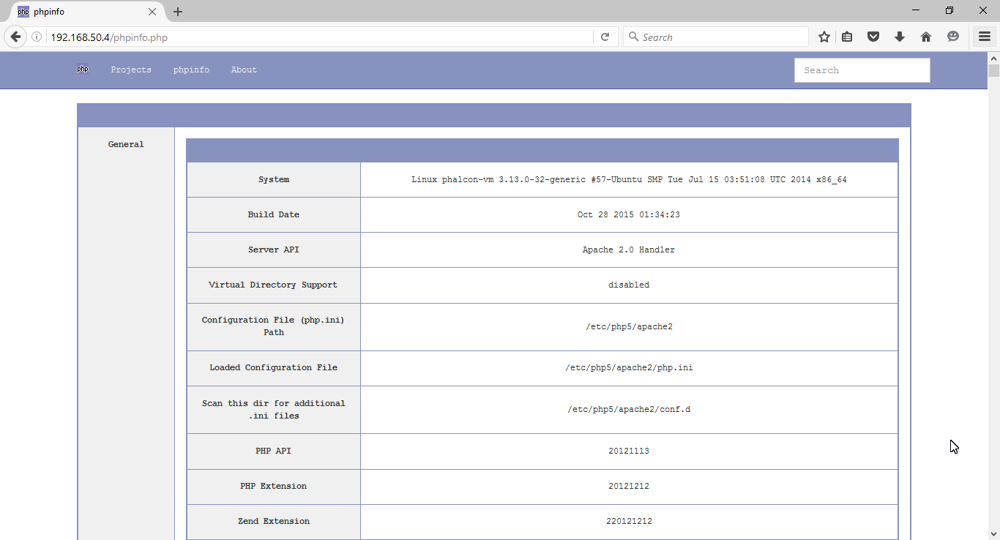
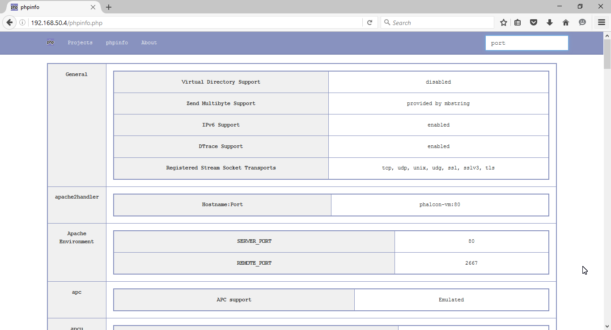

#phpinfo -  a sexy alternative to phpinfo()
Think of this as a reskinned version of https://gist.github.com/krisanalfa/8315091 this is a simple php page that can be integrated in any project.

## Screenshots

